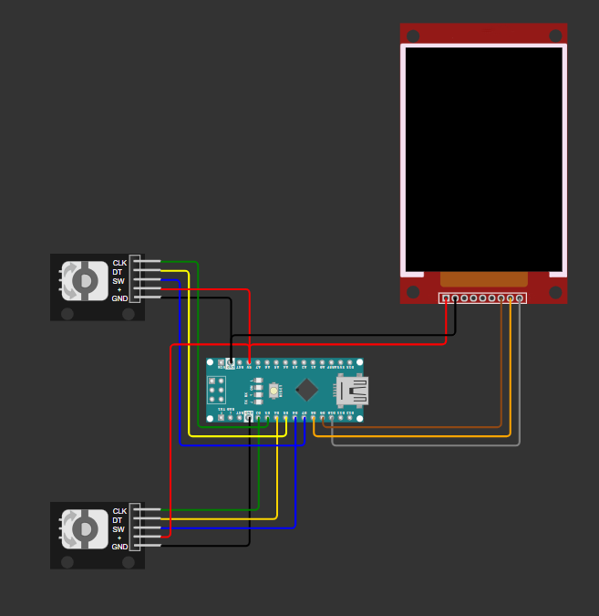

# **Double Bite – A Multiplayer-Snake Game for Arduino Nano**  

## **Description**  
- **Double Bite** is a **competitive two-player snake game**.  
- Each player **controls a separate snake** using **rotary encoders**, where the **threshold for rotation is customizable**.  
- **Player 1 (Blue Snake)** and **Player 2 (Red Snake)** compete to **grow the longest snake** by the end of **30 seconds**.  
- **Pressing the encoder button temporarily increases speed**, allowing for quick maneuvers.  
- The game is optimized for **Arduino Nano** with a **TFT LCD display**.  

## **Dependencies**
To run Double Bite, ensure you have the following library installed:
- **TFT_22_ILI9225.h** → Required for rendering on the **2.2" ILI9225 TFT LCD display**.
  
Install the libraries using the Arduino Library Manager or manually from the Arduino IDE.

## **Game Logic**  
1. **Player 1 (Blue Snake) & Player 2 (Red Snake)** start with an **initial length of 5**.  
2. **Walls & Food**:  
   - **10 random walls** are generated at the start of every game.  
   - **10 food items** are placed randomly.  
   - Each time **food is eaten**, a **new food item spawns** at a different location.  
3. **Movement Rules**:  
   - **Hitting the wall** → **Pass through it, but your snake resets to its initial length of 5**.  
   - **Hitting the opponent's snake** → **Lose 1 length (only if length > 5), otherwise no penalty**.  
   - **Hitting yourself** → **Allowed, no penalty**.  
4. **Game Objective**:  
   - The player with the **longest snake after 30 seconds wins**.  
5. **Speed Boost Mechanic**:  
   - Pressing the **encoder button** makes your snake move **faster for a short duration**.  

## **Rotary Encoder Configuration**  
- **Each player can adjust their own rotation threshold**, determining how many turns are required to change direction.  
- The threshold values have been **tested extensively** and set to:  
  - **Minimum: 2 counts per rotation**  
  - **Maximum: 15 counts per rotation**  
- This ensures **precise control** and allows players to customize sensitivity according to their playstyle.  

## **Control Scheme**  
- **Each player uses a rotary encoder to control their snake**, but the number of rotations required for a turn **can be customized**.  
- **Turning Directions:**  
  - **Clockwise (CW) → Move Right**  
  - **Counterclockwise (CCW) → Move Left**  
- **Pressing the button on the encoder gives a temporary speed boost**.  

## **Gameplay Features**  
- **Two-player mode** with independent snake movement.  
- **Survival-based objective** – The player with the **longest snake at 30 seconds wins**.  
- **Customizable rotary encoder sensitivity** for fine-tuned control.  
- **Pass-through walls with length reset** for added strategy.  
- **Colliding with opponent reduces length (if length > 5)**.  
- **No penalty for self-collision**.  
- **Speed boost on button press** for quick escapes and aggressive plays.  
- **Randomly generated walls and food placement** for varied gameplay.  
- **Score tracking and game-over logic**.  

## **Circuit and Components**  
### **Circuit Diagram**  
The circuit for the game is as follows:  

  
### **Arduino Nano**  
- Handles **game logic**, **screen updates**, and **encoder input**.  
- Uses **SPI protocol** for the **TFT LCD display**.  
- Compact size makes it ideal for embedded game projects.  

### **TFT 2.2" ILI9225 LCD Display**  
- Uses **SPI communication** for rendering graphics.  
- Requires **TFT_22_ILI9225.h** library.  

### **Rotary Encoders (x2)**  
- **Each player has an independent encoder** for movement.  
- Players can **set their own threshold** for turning sensitivity.  
- Connected to **Nano’s pins 2, 3, 4, 5** (CLK & DT for both encoders).  
- **Push-button switch temporarily increases speed** (connected to pins 6 & 7).  
